[artifice.cloud](https://artifice.cloud) &nbsp;·&nbsp;
[instagram](https://www.instagram.com/andreacacioppo_/) &nbsp;·&nbsp;
[linkedin](https://www.linkedin.com/in/andrea-cacioppo1/) &nbsp;·&nbsp;
[email](mailto:andreacacioppo04@gmail.com)

> AI engineer & full-stack developer, based in Italy. 
> Agentic systems that ship, not demos.

Right now that's [adobe-indesign-mcp](https://github.com/nutriandrea/adobe-indesign-mcp) — full InDesign DOM control from any AI agent. Also deep into WiFi CSI sensing: presence, breathing, heartbeat from plain radio signals.

<samp>typescript &nbsp; python &nbsp; react &nbsp; javascript &nbsp; java &nbsp; c &nbsp; fastapi &nbsp; supabase &nbsp; vite &nbsp; vhdl &nbsp; arduino &nbsp; html &nbsp; css &nbsp; git &nbsp; linux</samp>

**[adobe-indesign-mcp](https://github.com/nutriandrea/adobe-indesign-mcp)** &nbsp;·&nbsp; <samp>typescript, uxp</samp> 
The most comprehensive MCP server for Adobe InDesign — 183 tools, 
31 handlers, full DOM control from any AI agent.

**[IF_I_WIFI](https://github.com/nutriandrea/IF_I_WIFI)** &nbsp;·&nbsp; <samp>python, esp32</samp> 
WiFi CSI sensing: presence, breathing, heartbeat, sleep from radio 
signals. Honest fork of RuView with the fake ML removed.

**[thesis-companion](https://github.com/nutriandrea/thesis-companion)** &nbsp;·&nbsp; <samp>typescript, supabase</samp> 
Socrate — conversational AI companion for thesis writing and 
research management.

**[pubmed-vuln-research](https://github.com/nutriandrea/pubmed-vuln-research)** &nbsp;·&nbsp; <samp>python, rag</samp> 
Automated vulnerability research and reporting over PubMed data — 
agentic RAG pipeline from CVE to report.

Every graphic here is generated, not embedded from anyone else's server. 
`ascii.svg` is a photo pushed through a character ramp; the stat graphics and 
these section headings are drawn by [a scheduled action](.github/workflows/stats.yml) 
straight from the GitHub GraphQL API, once a day, committing only what changed.

They animate with SMIL inside the SVG, because GitHub strips scripts from 
READMEs — and since nothing loads from a third party, nothing here can 
rate-limit or go dark. The headings are SVGs for the same reason: GitHub also 
strips CSS, so an image is the only way to put this page's own typeface on them.

The typeface is [JetBrains Mono](scripts/fonts), subset to just the characters 
each graphic draws and inlined as base64. That isn't only for looks: the 
portrait's grid assumes an advance width of exactly 0.600 em, and a viewer whose 
default monospace is narrower would otherwise see it squeezed.

Language totals cover public repositories only. `year.svg` uses the portrait's 
character ramp: `:` `+` `#` `@`, quiet to loud.
